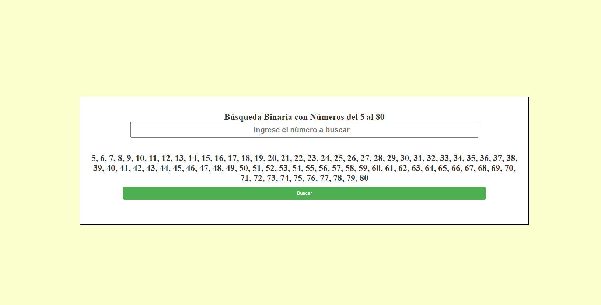
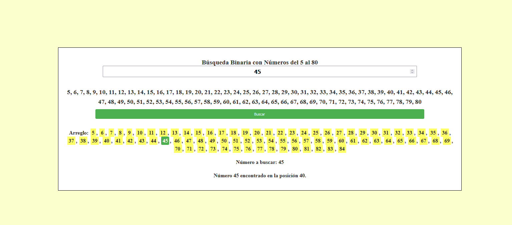
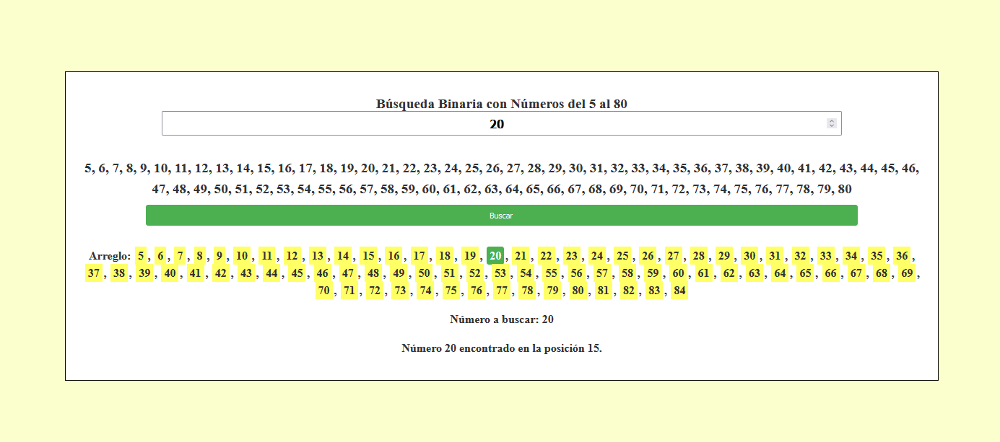

# Búsqueda Binaria con Números

ℹ️ **Descripción**
Este proyecto es un ejemplo de implementación de búsqueda binaria en JavaScript. Proporciona una interfaz simple para buscar un número específico dentro de un arreglo de números ordenados del 5 al 80.

📋 **Contenido**
- [Estructura del Proyecto](#estructura-del-proyecto)
- [Funcionamiento](#funcionamiento)
- [Estilos CSS](#estilos-css)
- [JavaScript](#javascript)
- [Instrucciones de Uso](#instrucciones-de-uso)

## Estructura del Proyecto

### HTML 🌐
El archivo HTML establece la estructura de la aplicación. Contiene elementos de entrada para ingresar el número a buscar y muestra los resultados de la búsqueda.

### Estilos CSS 🎨
El CSS proporciona estilos visuales para la interfaz de usuario, incluyendo colores, tamaños y disposición de los elementos.

### JavaScript 🧩
El código JavaScript contiene la lógica de la búsqueda binaria. Implementa la función `busquedaBinaria` para buscar el número ingresado por el usuario en el arreglo predefinido.

## Funcionamiento

La búsqueda binaria es un algoritmo eficiente que busca un elemento en un arreglo ordenado dividiendo repetidamente a la mitad el segmento de búsqueda. Se compara el elemento buscado con el elemento en el medio del arreglo y se ajusta el segmento de búsqueda en consecuencia.

### Instrucciones de Uso

1. Ingresa un número en el campo de búsqueda.
2. Haz clic en el botón "Buscar".
3. Se mostrará la lista de números y el resultado de la búsqueda.

### Imagenes de la App

¡Experimenta con diferentes números para ver cómo funciona la búsqueda binaria en acción!

🚀 ¡Disfruta explorando este proyecto!

